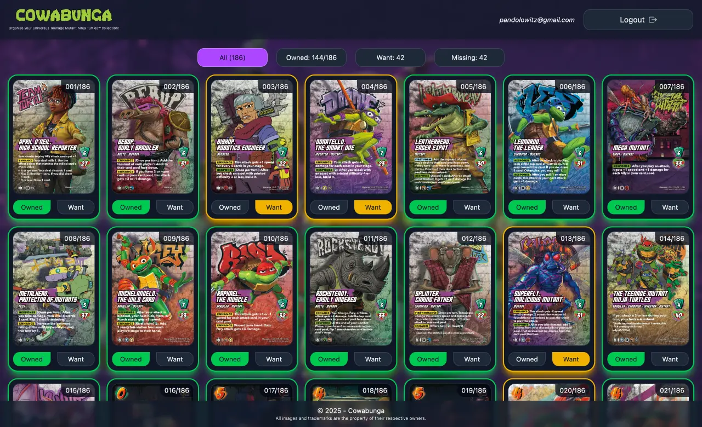
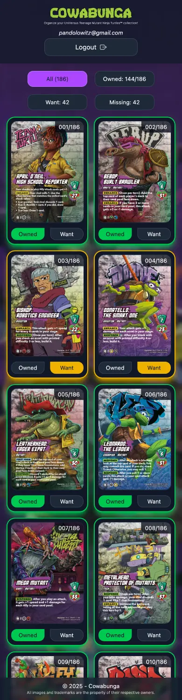

# Cowabunga

## Table of contents

<details>
    <summary>
        CLICK TO ENLARGE 😇
    </summary>
    <a href="#description">Description</a>
    <br>
    <a href="#objectives">Objectives</a>
    <br>
    <a href="#tech-stack">Tech stack</a>
    <br>
    <a href="#files-description">Files description</a>
    <br>
    <a href="#installation_and_how_to_use">Installation and how to use</a>
    <br>
    <a href="#whats-next">What's next?</a>
    <br>
    <a href="#thanks">Thanks</a>
    <br>
    <a href="#authors">Authors</a>
</details>

## <span id="description">Description</span>

Cowabunga is a lightweight web application to inventory Teenage Mutant Ninja Turtles cards from the UniVersus company.
<br>
The idea came after a London trip where we discovered with a friend a new TMNT card collection and started buying packs.

I used the opportunity to continue practicing React, try out Supabase (Auth + Postgres), and ship a minimal but usable app in ~2 days.

This is a personal, non-commercial project. Not affiliated with UVS Games, Nickelodeon, or any rights holder. All trademarks belong to their respective owners.

## <span id="objectives">Objectives</span>

- Practice a fast end-to-end flow: Vite + React, Supabase for Auth/DB, GitHub Pages deployment.
- Keep the scope minimal yet useful: Google sign-in, list + simple inventory states, sorting...
- Structure data for future expansion.
- Keep code readable and straightforward.

## <span id="tech-stack">Tech stack</span>

<p align="left">
    
    
    
    
    
    
    
    
    
    
    
</p>

## <span id="files-description">Files description</span>

| **FILES**           | **DESCRIPTION**                                   |
| :-----------------: | ------------------------------------------------- |
| `public`            | Public assets.                                    |
| `src`               | React source code (components, utilities...).     |
| `index.html`        | Application's HTML entry point.                   |
| `vite.config.js`    | Vite configuration for development and building.  |
| `package.json`      | Dependencies and scripts configuration.           |
| `package-lock.json` | Exact dependency version lockfile.                |
| `eslint.config.js`  | Linter configuration to enforce code quality.     |
| `.gitignore`        | Specifies files and folders to be ignored by Git. |
| `README.md`         | The README file you are currently reading 😉.     |

## <span id="installation_and_how_to_use">Installation and how to use</span>

### Installation

1. Clone this repository:
    - Open your preferred Terminal.
    - Navigate to the directory where you want to clone the repository.
    - Run the following command:

```bash
git clone https://github.com/fchavonet/web-cowabunga.git
```

2. Open the repository you've just cloned.

3. Install dependencies:

```bash
npm install
```

4. Create a Supabase account and project:

    - Go to [Supabase](https://supabase.com) and sign up.
    - Click “New project” → Choose an organization (or create one).
    - Name your project (e.g., cowabunga) and choose your region.
    - Wait for Supabase to initialize the database.

5. Create the card_status table:

    - In your Supabase Dashboard, go to Database → Table editor.
    - Click “New table”, name it `card_status`.
    - Add the following columns:

| **Name**     | **Type**      | **Default value** | **Notes**                      |
| :----------: | :-----------: | :---------------: | ------------------------------ |
| `user_id`    | `uuid`        | -                 | Foreign key → `auth.users.id`. |
| `card_id`    | `text`        | -                 | Card identifier.               |
| `owned`      | `bool`        | `whether`         | The user owns this card.       |
| `wanted`     | `bool`        | `whether`         | The user wants this card.      |
| `updated_at` | `timestamptz` | `now()`           | Last update timestamp.         |

    - Enable Row Level Security (RLS) on the table.
    - Add the following policy rules (SQL or via UI):

```sql
-- Allow users to read only their own rows.
create policy "Users can view their own card status"
on card_status for select
using (auth.uid() = user_id);

-- Allow users to insert their own data.
create policy "Users can insert their own card status"
on card_status for insert
with check (auth.uid() = user_id);

-- Allow users to update their own data.
create policy "Users can update their own card status"
on card_status for update
using (auth.uid() = user_id);
```

6. Configure environment variables:

    - Create a `.env.local` file at the project root with:

```bash
VITE_SUPABASE_URL=your_supabase_project_url
VITE_SUPABASE_ANON_KEY=your_supabase_anon_key
```

    - In Supabase Dashboard, go to Settings → API, then copy your Project URL and anon public key.
    - Then enable Google provider under Authentication → Providers, and set your Redirect URLs to match local environments:

```bash
http://localhost:3000
```

7. Start the development server:

```bash
npm run dev
```

### How to use

1. Open the app and sign in with Google.
2. Browse the cards list.
3. Toggle Owned / Want on any card.
4. Use sorting controls to reorganize the list.

You can also test the web application online by clicking [here](https://fchavonet.github.io/web-cowabunga/). 

<table>
    <tr>
        <th align="center" style="text-align: center;">Desktop view</th>
        <th align="center" style="text-align: center;">Mobile view</th>
    </tr>
    <tr valign="top">
        <td align="center">
            
        </td>
        <td align="center">
            
        </td>
    </tr>
</table>

## <span id="whats-next">What's next?</span>

- Search & filters (character, rarity...).
- CSV import/export to batch update inventory.
- PWA & offline caching for quick mobile access.
- Add last images (secret cards).

## <span id="thanks">Thanks</span>

- Supabase for the fantastic developer experience!
- UniVersus / UVS Games and the TMNT community for the inspiration and card ecosystem.
- Friends who tested the app and gave quick feedback.

## <span id="authors">Authors</span>

**Fabien CHAVONET**
- GitHub: [@fchavonet](https://github.com/fchavonet)
